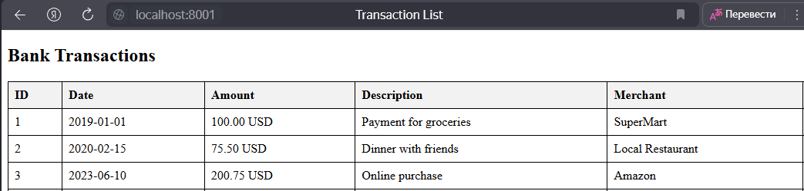
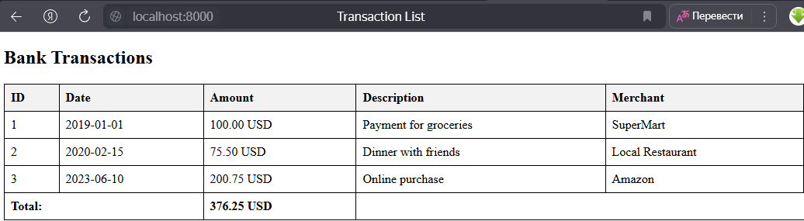
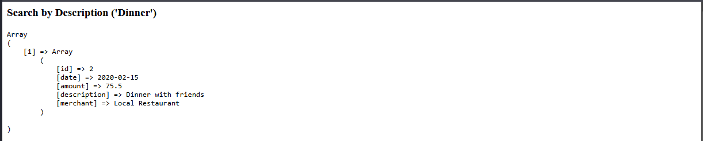
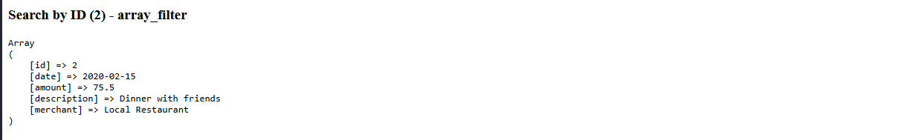
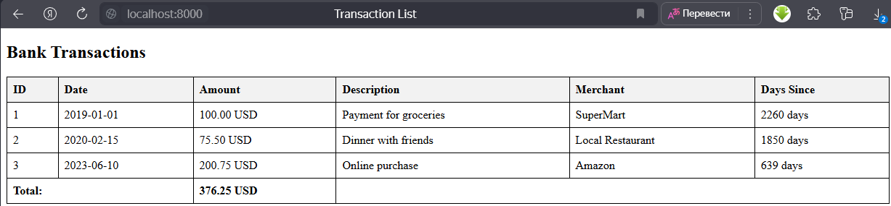
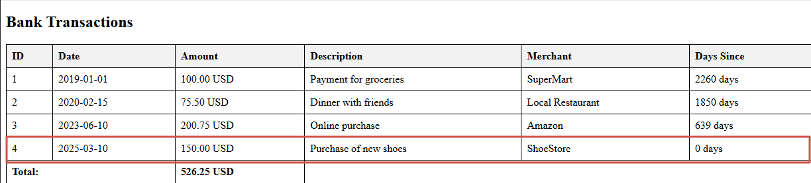
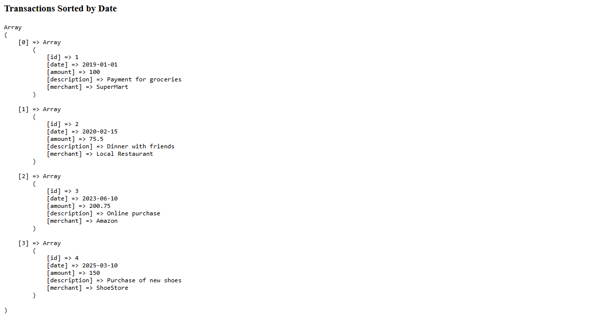
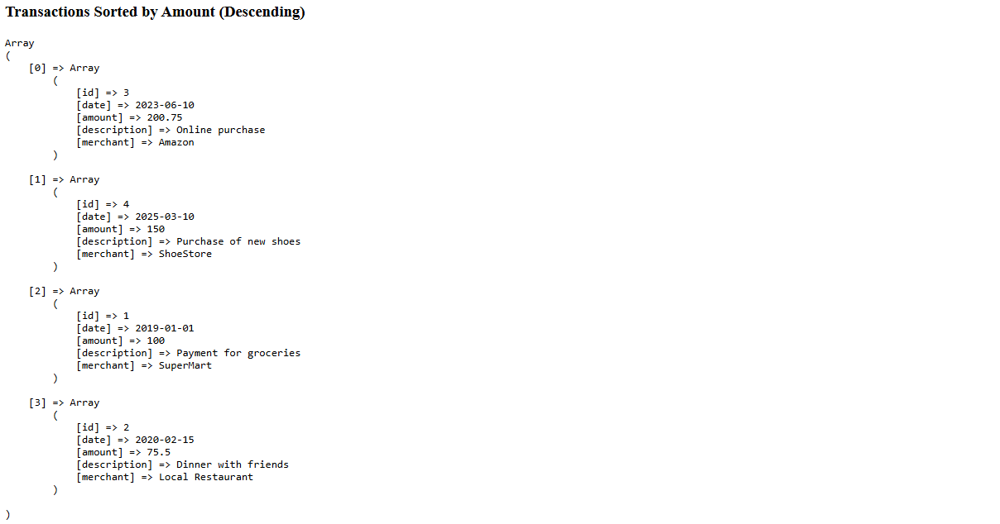

# Отчет по лабораторной работе

## Цель работы

Освоить работу с массивами в PHP, применяя различные операции: создание, добавление, удаление, сортировка и поиск. Закрепить навыки работы с функциями, включая передачу аргументов, возвращаемые значения и анонимные функции.

## Задание 1. Работа с массивами

### Требования для задания №1

Разработать систему управления банковскими транзакциями с возможностью:

- добавления новых транзакций
- удаления транзакций
- сортировки транзакций по дате или сумме
- поиска транзакций по описанию

### Выполнение

1. В начале файла включена строгая типизация:

   ```php
   <?php
   declare(strict_types=1);
   ```

2. Создан массив `$transactions`, содержащий информацию о банковских транзакциях. Каждая транзакция представлена в виде ассоциативного массива с полями:
   - `id` – уникальный идентификатор транзакции;
   - `date` – дата совершения транзакции (YYYY-MM-DD);
   - `amount` – сумма транзакции;
   - `description` – описание назначения платежа;
   - `merchant` – название организации, получившей платеж.

3. Выведен список транзакций в виде HTML-таблицы:
   

4. Реализованы функции:
   - `calculateTotalAmount` – вычисляет общую сумму всех транзакций. Итоговая сумма отображается в таблице.
     
   - `findTransactionByDescription` – ищет транзакцию по части описания.
     
   - `findTransactionById` – ищет транзакцию по идентификатору с помощью `array_filter()`.
     
   - `daysSinceTransaction` – возвращает количество дней между датой транзакции и текущим днем. Добавлен соответствующий столбец в таблицу.
     
   - `addTransaction` – добавляет новую транзакцию в массив.
     

5. Реализована сортировка транзакций:
   - По дате с использованием `usort()`.
     
   - По сумме (по убыванию).
     

## Задание 2. Работа с файловой системой

### Требования для задания №2

- Создать директорию `images`, в которой сохранить не менее 20-30 изображений с расширением `.jpg`.
- Создать файл `index.php`, в котором определить веб-страницу с хедером, меню, контентом и футером.
- Вывести изображения из директории `images` на веб-страницу в виде галереи.

### Реализация

В результате выполнения задания была создана веб-страница с:

- заголовком
- меню;
- контентом в виде галереи изображений;
- футером.


## Контрольный вопросы

1. Что такое массивы в PHP?
Массив в PHP — это структура данных, позволяющая хранить набор значений под одним именем. Они могут быть индексными (с числовыми ключами) или ассоциативными (с именованными ключами).

2. Каким образом можно создать массив в PHP?

```php
$indexedArray = [1, 2, 3]; // Индексный массив
$assocArray = ["key1" => "value1", "key2" => "value2"]; // Ассоциативный массив
```

## Вывод

В ходе работы были закреплены навыки работы с массивами, реализованы функции для обработки транзакций, выполнены сортировка и поиск данных. Также освоены основные операции работы с файловой системой в PHP.
